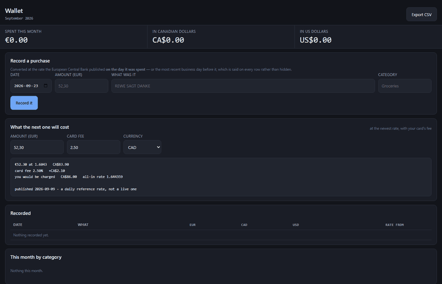

# Wallet — euro spending in CAD and USD

[](https://github.com/luke-zhang-cs-py/Budgeting-EU-to-CAD-USD-Automatic/actions/workflows/python-package.yml)
[](LICENSE)
[](https://www.python.org/)

You spent €52.30 in Berlin. Your Canadian card billed you CA$85.94. Was that
fair? This converts every purchase at the rate the European Central Bank
published **on the day you spent it** — and shows what the card's markup cost.

### ▶ Try it now, no install

- **[The wallet](https://luke-zhang-cs-py.github.io/Budgeting-EU-to-CAD-USD-Automatic/app/)** — record purchases and convert them, entirely in your browser
- **[The capture page](https://luke-zhang-cs-py.github.io/Budgeting-EU-to-CAD-USD-Automatic/capture/)** — photograph a receipt on your phone and it reads the figures



*Running with no server. Watch the Sunday purchase (Deutsche Bahn, 6 Sep): the
ECB published nothing that day, so it takes Friday's rate and says so — `+2d`.*

**[Read the full write-up →](https://luke-zhang-cs-py.github.io/Budgeting-EU-to-CAD-USD-Automatic/)**
— how the screenshot reader decides what an amount is, why "real time" is the
wrong promise for a card rate, and every bug this has had.
(Or open [`docs/index.html`](docs/index.html) locally.)

## What the conversion actually cost

A Canadian card used in Europe doesn't bill euros. CIBC converts at the Visa
rate and adds 2.5%, so the export shows CAD already converted, at a rate you
were never told. Because the ECB rate is stored per transaction date, the
comparison is free:

```
2026-09-02  REWE SAGT DANKE     €52.30
            billed by the card  CA$85.94
            at the ECB rate     CA$83.85
            the conversion cost CA$ 2.09   (2.49%)
```

When the original euro figure can't be recovered from the description, the row
is refused rather than guessed at — a 200 SEK lunch booked as EUR 200 is a
twenty-fold error that looks entirely plausible.

## The part that's easy to get wrong

The ECB publishes **on business days only** — no weekend rows at all, and the
longest gap in the series is five days. So a Sunday purchase has no rate of its
own. This walks back to the last published day and **records which day it used**:

| Spent on | Rate from | Lag |
|---|---|---|
| Tue 8 Sep 2026 | 8 Sep | 0 |
| Sun 6 Sep 2026 | 4 Sep | 2 |
| Easter Sun 5 Apr 2026 | 2 Apr | 3 |

It never reaches *forward* for a nearer rate. 5 April is one day from the 7th
and three from the 2nd, but the 7th hadn't happened yet — using it would make a
closed month's total change every time the file was refreshed.

## Run it

```bash
pip install -r requirements.txt
python app.py                        # http://127.0.0.1:5004
pip install -r requirements-ocr.txt  # optional: read receipts from screenshots
```

The first run caches the ECB history — one 640 KB file back to 1999 — then
works offline. No account, no API key, no bank connection.

**Getting data in:** a watched folder your phone already syncs, a `.qfx`
export (which carries the bank's own rate and id), a CSV in any layout, or
typed by hand. `data/sample-statement.csv` is included to try it.

## Where the code is

Four packages and three files at the root. The packages are layered, and the
layering is *asserted* by `tests/test_structure.py` rather than left to
convention — nothing imports upward — so this is also the dependency order:

```
core/     money, paths, fetch,     the primitives; no first-party imports,
          auth                     and who is allowed in at all
fx/       fxrates, fxcost,         the euro series, what a conversion costs,
          fxlive, pounds           and the CAD->GBP side trip
domain/   db, ledger, cards,       the ledger, and everything derived from it
          budgets, goals, trends,
          upcoming, export
ingest/   layout, importers, ofx,  getting purchases in: files, folders and
          ocr, receipts, sources   screenshots
app.py    the routes, and nothing else
wsgi.py   the entry point a real server uses -- gunicorn wsgi:application
```

Those two stay at the root because they're named from outside the repo (the
Dockerfile `CMD`, the Fly and Render configs) and Flask resolves `templates/`
relative to the module the app is built in.

## Hosting it

It binds `127.0.0.1` with no password because it holds your spending history,
and it refuses to start reachable without one. See **[DEPLOYMENT.md](DEPLOYMENT.md)**
for the Fly.io walkthrough and what the protection is and isn't.

## Tests

```bash
pytest -q
```

904 tests, 100% of 2,482 statements — and that figure is itself checked, so it
can't quietly go stale.

## License

[MIT](LICENSE) — see [CONTRIBUTING.md](CONTRIBUTING.md) for setup and conventions.
